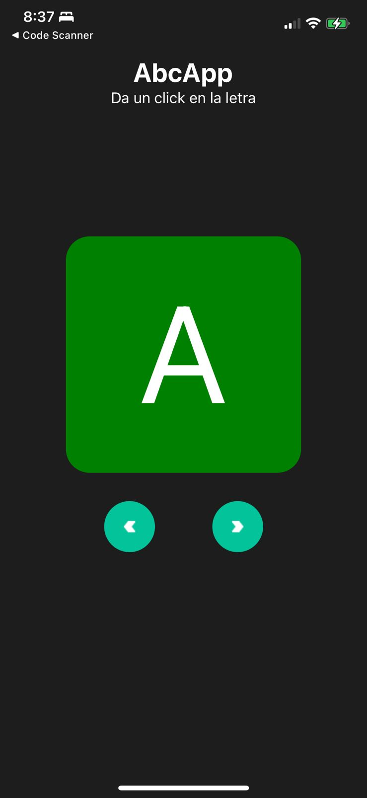
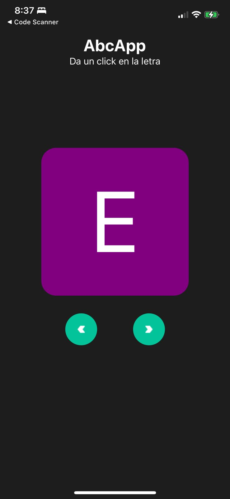

# Bienvenido a mi app de letras del abecedario

Esta app te muestra una letra del abecedario y al dar click en ella te muestra un sonido

## Vista previa

<div>
    
    
</div>

## Como descargar el proyecto

```bash
git clone https://github.com/angelcruz07/letras-abecedario.git
```

```bash
npm install
```

```bash
npm start
```

Pulsa la tecla s y escanea el codigo con la aplicacion de ExpoGo


Descarga el archivo apk en el siguiente link

https://drive.google.com/file/d/1Er_S0qb_Ftx33KjrXOgpdOGAUuCP0xa-/view?usp=sharing
